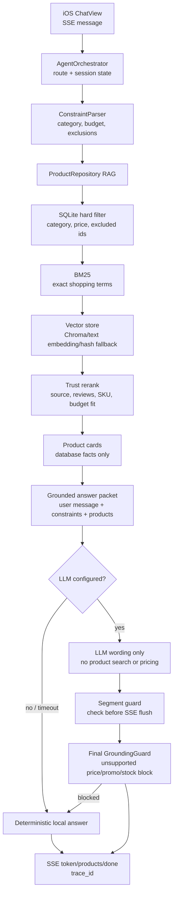

# 3 分钟核心链路讲解

## 一句话定位

ShopGuide 是原生 iOS + FastAPI 的多模态电商导购 Agent。LLM 负责理解意图和生成自然语言，商品事实、筛选、排序、加购、下单和防幻觉都由后端确定性工具控制。

## 请求链路

1. iOS 通过 SSE 发送用户消息，后端创建 `trace_id`。
2. `AgentOrchestrator` 先做路由：闲聊、导购、对比、追问、购物车、售后、天气/旅行规划。
3. 导购请求进入 `ConstraintParser`，抽取类目、预算、包含偏好、排除词、排除品牌。
4. `ProductRepository` 检索：
   - SQLite 先硬过滤类目、价格、排除商品。
   - BM25 处理精确关键词。
   - 向量层处理语义召回：Chroma/text embedding 优先，未配置时 hashing fallback。
   - 结构化命中、预算匹配、公开来源、评论、SKU 完整度进入最终重排。
5. 商品卡片先通过 SSE 发给 App，保证首 token 和首屏响应快。
6. 文案生成有两条路：
   - 显式购物 fast-path：直接用本地确定性 grounded 文案。
   - 配置 LLM 时：LLM 只能基于已检索商品和约束润色回复，最后必须通过 `GroundingGuard`。
7. `done` 事件返回 `trace_id`，可在 `/api/traces/{trace_id}` 复盘每一步。



## 为什么不会幻觉

- 商品卡片、价格、SKU、库存、来源 URL 只来自 SQLite 商品库。
- LLM 文案生成后会被 `GroundingGuard` 校验；编造优惠、价格、库存、销量、平台政策会被拦截。
- 售后和支付明确是 Demo 边界，不承诺真实物流、支付或平台政策。
- 无 LLM key、LLM 超时或 Guard 失败时，系统自动降级到确定性回复，不影响演示。

## 向量库怎么讲

默认本地演示用 SQLite + hashing 向量，零配置、稳定可跑。需要展示标准向量数据库时，设置：

```bash
pip install -r server/requirements-optional.txt
VECTOR_STORE_BACKEND=chroma PYTHONPATH=server python -m uvicorn app.main:app --host 127.0.0.1 --port 8000
```

Chroma 只负责向量相似度，不负责商品事实。`/api/health`、`/api/metrics`、`/admin/metrics` 都会显示实际 active backend；如果安装失败，会明确显示 SQLite fallback。

## 可观测性展示

答辩时打开：

- `/admin/metrics`：商品覆盖、当前向量库、首 token、p50/p95/p99、缓存命中率。
- `/api/traces/{trace_id}`：路由、约束、检索栈、候选数量、商品 ID、Guard 结果。
- iOS 商品详情：match score、match reasons、risk flags，解释为什么推荐这款。
