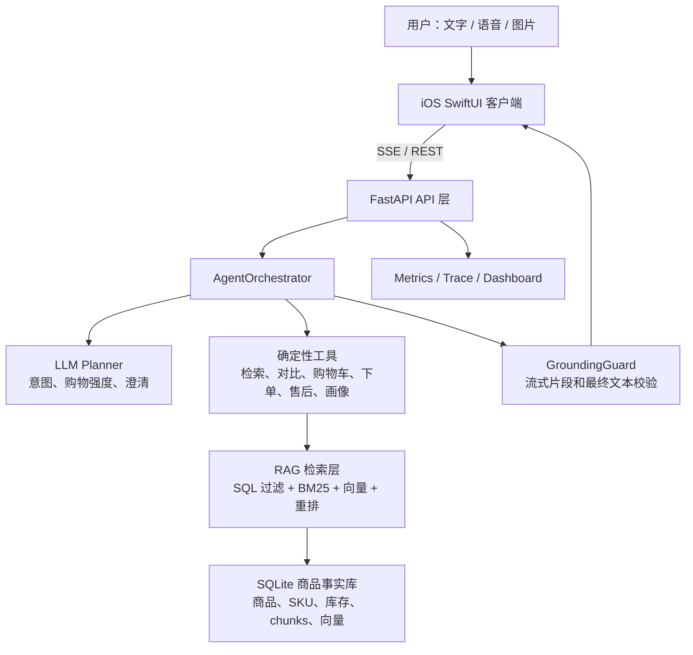

# 智购罗盘 CartCompass 技术设计文档

## 1. 项目概述

智购罗盘 CartCompass 是一个基于 RAG 的多模态电商智能导购 AI Agent。用户可以通过文字、语音或图片表达购物需求，系统会在普通对话中完成需求澄清、商品推荐、对比、追问、加购、模拟下单和售后边界说明。

项目的核心设计原则是“模型做理解，事实由工具给出”。LLM 只负责意图规划、约束补全和自然语言表达；商品事实、价格、SKU、库存、来源、购物车和订单状态全部来自本地数据库和后端确定性工具，最终输出再经过 GroundingGuard 校验，降低电商导购场景中的价格、库存、优惠和售后幻觉。

## 2. 系统架构



端到端链路：

1. iOS 通过 `POST /api/chat/stream` 建立 SSE 连接，后端按 `token/products/compare/cart/order/plan/done` 事件流式返回。
2. `AgentOrchestrator` 先执行高置信规则分支，再调用 LLM planner 判断本轮是闲聊、导购、澄清、对比、商品追问、购物车、售后还是旅行场景。
3. 导购请求进入 `ConstraintParser`，抽取类目、预算、偏好、排除词、排除品牌等结构化约束。
4. `ProductRepository` 用 SQL 硬过滤候选，再融合 BM25、文本/多模态向量、hashing 兜底和可信度信号排序。
5. 商品卡先由工具直接返回，LLM 只在 grounded packet 内生成简短解释；GroundingGuard 拦截未落库价格、优惠、库存、销量和承诺。
6. `/admin/metrics` 和 `/api/traces/{trace_id}` 记录首 token、检索、LLM、Guard、缓存命中等链路信息。

## 3. 技术栈

| 层级 | 技术 |
|---|---|
| iOS 客户端 | SwiftUI、SwiftData、Observation、AVFoundation TTS、Speech ASR、PhotosUI、UIKit 相机桥接 |
| 后端 API | Python 3.11、FastAPI、SSE StreamingResponse、Pydantic v2、Uvicorn |
| 数据与 RAG | SQLite、商品 chunks、BM25、hashing vector、可选 Chroma、可选 Ark/Doubao embedding |
| 多模态 | 相机/相册上传、VLM 图像理解、Doubao 多模态 embedding、CLIP/轻量视觉 fallback；端侧 + 服务端(`/api/speech/transcribe`)双路语音转写 |
| Agent 与模型 | Ark/Doubao、DeepSeek 或 OpenAI-compatible Provider Gateway、结构化 JSON 校验、规则兜底 |
| 质量保障 | pytest、E2E evaluation cases、self-check、性能测量脚本、Trace 和 Dashboard |
| 部署 | 本地 Python venv、Docker Compose、SQLite 种子库自动复制 |

## 4. 目录结构

```text
.
├── README.md
├── docker-compose.yml
├── client-ios/
│   ├── ShopGuide.xcodeproj/          # 已提交 Xcode 工程，App 显示名为智购罗盘
│   ├── project.yml                   # xcodegen 配置
│   └── ShopGuide/
│       ├── Views/                    # 聊天、商品、购物车、Profile、隐私等页面
│       ├── Services/                 # API、SSE、图片搜索、购物车服务
│       ├── Models/                   # 商品、消息、历史会话模型
│       └── Resources/                # Info.plist、Assets
├── server/
│   ├── app/
│   │   ├── agent/                    # Agent 编排、约束解析、购物车、售后、画像
│   │   ├── api/                      # FastAPI 路由
│   │   ├── rag/                      # 商品库、向量、图片搜索、缓存
│   │   ├── llm/                      # Provider gateway、结构化校验
│   │   └── checkout/                 # 沙箱结算与订单
│   ├── data_pipeline/                # 采集、清洗、导出
│   ├── evaluation/                   # 自动化评测用例与报告生成
│   ├── scripts/                      # 自检、入库、性能、embedding、采集脚本
│   ├── static/product_images/        # 演示商品图片
│   ├── storage/seed.sqlite3          # 开箱即用种子库
│   └── tests/                        # pytest 测试
└── docs/                             # 架构、RAG、API、演示、提交文档
```

## 5. 依赖环境

- macOS + Xcode 15 或更新版本，用于运行 iOS 17 SwiftUI App。
- Python 3.10+，推荐 Python 3.11。
- 后端必需依赖见 `server/requirements.txt`：FastAPI、Uvicorn、Pydantic、Pillow、httpx、pytest 等。
- 可选 Chroma 向量库依赖见 `server/requirements-optional.txt`。
- 可选模型能力：`ARK_API_KEY`、`TEXT_EMBEDDING_*`、`VISION_UNDERSTANDING_*`。未配置时系统自动走本地检索和规则兜底。

## 6. 配置说明

| 配置项 | 说明 |
|---|---|
| `CARTCOMPASS_DB` | 运行库路径，默认 `server/storage/shopguide.sqlite3`；旧 `SHOPGUIDE_DB` 兼容 |
| `CARTCOMPASS_STATIC_DIR` | 静态资源目录，默认 `server/static`；旧 `SHOPGUIDE_STATIC_DIR` 兼容 |
| `ARK_API_KEY` | Ark/Doubao 对话模型和默认 VLM/embedding Key |
| `TEXT_EMBEDDING_MODEL` | 文本/多模态 embedding 模型，示例 `doubao-embedding-vision-251215` |
| `VISION_UNDERSTANDING_MODEL` | 图片理解模型，默认 `doubao-seed-2-0-lite-260428` |
| `SPEECH_TRANSCRIPTION_MODEL` | 服务端语音转写模型，留空回退 `ARK_MODEL`；端侧识别不依赖此项 |
| `VECTOR_STORE_BACKEND` | `sqlite` 或 `chroma` |
| `CHROMA_COLLECTION` | Chroma collection，默认 `cartcompass_products` |
| `CORS_ALLOW_ORIGINS` | CORS 允许来源，本地演示默认 `*` |

## 7. 数据与 RAG 设计

商品事实库包含商品标题、品牌、类目、价格、SKU、库存、图片、来源 URL、FAQ、评论和 RAG 文本。系统将商品信息拆分为 `identity/detail/faq/review` chunks，商品追问会优先读取对应 chunk 证据。

检索采用“硬约束优先、语义排序增强”的组合：

- SQL 先按类目、预算、排除品牌、排除成分等条件过滤。
- BM25 捕捉关键词、品牌、功能词和场景词。
- 文本/多模态 embedding 提供语义召回，未配置 key 时用本地 hashing vector 兜底。
- 排序阶段加入预算贴合、公开来源、SKU 完整度、评论分和负反馈风险。
- iOS 商品卡展示推荐理由、匹配分和来源，详情页展示 SKU、证据和风险提示。

## 8. Agent 设计

Agent 不是让 LLM 自由调用商品事实，而是 planner-first + tool-first：

- 高置信请求如“推荐手机”“把第一款加购物车”直接走 fast-path，降低首 token 延迟。
- 模糊请求如“推荐手机”会主动追问拍照、续航、性能和预算。
- 多轮对话通过 `SessionState` 保存最近商品、待补约束、购物车和 transcript。
- “第一款太贵了”“换个品牌”“有没有平替”等反馈会转化为替代品检索。
- 长期偏好如“护肤品不要酒精、我是油皮、预算 200”会写入用户画像，并在后续推荐中自动带上。

## 9. 多模态设计

iOS 端支持三类输入：

- 文字：普通聊天和导购命令。
- 语音：双路 ASR 互补——端侧 `SFSpeechRecognizer` 流式实时转写，或上传音频至服务端 `POST /api/speech/transcribe`；AVFoundation TTS 朗读简短回答，支持语速、音色调节与语音连续对话。
- 图片：相机/相册上传至 `/api/image_search`，后端融合 VLM 图像理解、多模态 embedding、CLIP/轻量视觉特征和文本 query。

拍照找货的核心是图文共享向量空间。图片 embedding 与商品文本 embedding 做余弦相似度，不依赖用户输入关键词，因此手机图可召回手机、防晒图可召回防晒。所有最终商品卡仍来自本地商品库。

## 10. 可信与安全边界

- 商品卡片由后端工具生成，LLM 不生成商品 ID、价格、SKU、库存。
- GroundingGuard 对流式片段和最终文本检查优惠、库存、销量、价格、平台承诺等风险。
- 售后回答明确说明 Demo 不产生真实支付、物流和平台售后承诺。
- 模型不可用、超时、JSON 非法或输出不可信时，系统回退到确定性规则和模板文案。
- 图片上传只用于当前检索，Demo 不实现真实用户账号和支付链路。

## 11. 可观测性与测试

后端提供：

- `GET /api/health`：服务、商品数、向量库、LLM、embedding 状态。
- `GET /api/metrics`：商品覆盖、向量库、计数器、缓存、延迟。
- `GET /admin/metrics`：可视化 Dashboard。
- `GET /api/traces/{trace_id}`：单次请求从意图到检索、Guard、输出的链路。

测试覆盖健康检查、SSE、澄清、反选、多轮上下文、平替、长期偏好、售后、购物车、模拟下单、图片搜索、observability 和数据管线。当前 **140 项 pytest 全部通过**，能力评测 **24/24（case 通过率 1.0）**，核心指标(Top-3 命中、反选过滤、主动澄清、加购、跨模态图搜、预算套装)全部为 1.0。评测脚本位于 `server/evaluation/`，可输出 JSON/HTML 报告。

## 12. 关键问题与解决方案

| 问题 | 解决方案 |
|---|---|
| LLM 容易编造价格、优惠和库存 | 商品事实只由工具提供，GroundingGuard 流式拦截风险片段，不可信时回退确定性文案 |
| 模糊需求容易乱推荐 | planner + 规则判断购物强度，不足时主动澄清；闲聊不弹商品卡 |
| 向量召回可能不符合硬约束 | SQL 先做类目、预算和排除项硬过滤，向量只在候选内增强排序 |
| 现场没有模型 Key | 本地 SQLite、BM25、hashing vector 和模板文案可离线运行 |
| 多模态结果难解释 | 返回 VLM 关键词、语义匹配分、视觉特征和融合排序理由 |
| 答辩难证明链路真实 | 每轮 `done` 带 `trace_id`，Dashboard 展示检索、Guard、缓存和延迟 |

## 13. 后续扩展

- 接入真实电商商品 API 和库存服务。
- 将用户画像接入账号体系并提供可视化编辑。
- 增加更完整的支付沙箱、订单状态回调和售后工单流。
- 扩充商品图像 embedding 离线预计算和 A/B 评测。
